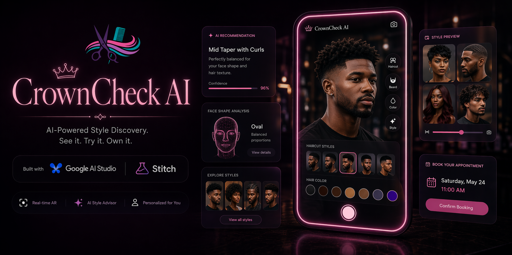

<div align="center">


# CrownCheck AI

**AI-powered salon & grooming experience — built with Google AI Studio, Gemini, and Stitch.**

[](https://crowncheck-ai-218838043219.us-west1.run.app/)
[](https://ai.google.dev/)
[](https://ai.studio/apps/e2303b39-82d1-4993-96ad-4cdc257f7501)
[](https://stitch.withgoogle.com/projects/9275784045586036046)
[](https://react.dev/)
[](https://tailwindcss.com/)
[](https://www.typescriptlang.org/)

**[Live App](https://crowncheck-ai-218838043219.us-west1.run.app/)** · **[Stitch Design](https://stitch.withgoogle.com/projects/9275784045586036046)** · **[AI Studio](https://ai.studio/apps/e2303b39-82d1-4993-96ad-4cdc257f7501)**

</div>

---

## What is CrownCheck AI?

CrownCheck AI is a luxury grooming and salon platform that uses AI to help users discover, visualize, and book their next hairstyle transformation. Scan your profile, preview styles in AR, browse a curated lookbook, and connect with professional consultants — all in one place.

---

## Features

- **AR Mirror** — Real-time hairstyle visualization using your camera and AI
- **Lookbook** — Browse a curated gallery of styles filtered by face shape, hair type, and trend
- **Consultant Marketplace** — Connect with professional stylists who can bring your AR look to life
- **Pricing** — Flexible plans for individuals and salons
- **Auth Flow** — Sign up / Sign in with protected route navigation
- **Dark & Light Theme** — Full theme system with a rich plum/pink editorial palette

---

## Tech Stack

| Layer | Technology |
|---|---|
| Framework | React 19 + TypeScript |
| Styling | Tailwind CSS v4 |
| Animation | Motion (Framer Motion) |
| AI | Google Gemini via `@google/genai` |
| UI Design | Google AI Studio + Stitch |
| Icons | Lucide React |
| Build | Vite 6 |

---

## Getting Started

**Prerequisites:** Node.js 18+

1. Install dependencies:
   ```bash
   npm install
   ```

2. Set your Gemini API key in `.env`:
   ```bash
   GEMINI_API_KEY=your_api_key_here
   ```

3. Run the dev server:
   ```bash
   npm run dev
   ```

4. Open [http://localhost:3000](http://localhost:3000)

---

## Project Structure

```
src/
├── components/       # Shared UI components (Logo, Footer, LookCard)
├── views/            # Page-level views (Landing, Mirror, Lookbook, etc.)
├── types/            # TypeScript types
└── index.css         # Global styles & theme tokens
```

---

## Built With

This app was designed and prototyped using **[Google AI Studio](https://ai.studio)** and **[Stitch](https://stitch.withgoogle.com)**, then extended with custom React components and Gemini AI integration.

---

<div align="center">
  Made with ♥ using Google AI Studio · Gemini · Stitch
</div>
